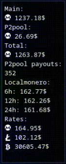
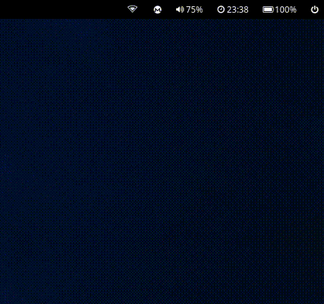

# waybar-monero 

## Monero &amp; P2pool ticker for waybar (and terminal)



For a fast overview of your XMR and P2pool stats, without having to open the wallet and wait for it to sync.

It also can get your [xmrvsbeast](https://xmrvsbeast.com/p2pool/) stats.

## Dependencies:
- You'll need some kind of crypto font (e.g. [cryptocoins](https://github.com/AllienWorks/cryptocoins/blob/master/webfont/cryptocoins.ttf), [wp-cryptofonts](https://github.com/evgrezanov/wp-cryptofonts/blob/5e598eba70798f20af6970e3c256ff06cbfe88a9/asset/fonts/cryptofont.ttf), [crypto-icons](https://github.com/guardaco/crypto-icons/blob/3f0ddf1352afe40269e4519c4cde6ed4a60a7350/fonts/coins.ttf)...)
- [Rates](https://github.com/lunush/rates), to convert to your favourite fiat currency
- [Waybar](https://github.com/Alexays/Waybar) (haven't tested with others like polybar, but it should be easy enough to modify it for it)

The rest is done using [P2pool's observer](https://p2pool.observer/api) API and some minimal, direct scraping of the website;  
and [Localmonero's](https://localmonero.co/web/ticker?currencyCode=USD) API (can be USD, GBP, EUR or HKD).
<br clear="right"/>

## Installation

1. Download or clone this repo and put [waybar-monero.sh](https://github.com/muvment/waybar-monero/raw/main/waybar-monero.sh) in `~/.config/waybar/scripts/` for example
<details>
  <summary>Expand</summary>
    
- With curl
```bash
# Make directory if needed
mkdir ~/.config/waybar/scripts

# Download the script
curl -LJO 'https://github.com/muvment/waybar-monero/raw/main/waybar-monero.sh'

# Copy the script into your scripts folder
mv waybar-monero.sh ~/.config/waybar/scripts

# Make it executable
chmod +x ~/.config/waybar/scripts/waybar-monero.sh
```
- With git
```bash
# Make directory if needed
mkdir ~/.config/waybar/scripts

# Clone the repo
git clone https://github.com/muvment/waybar-monero

# cd into the cloned folder
cd waybar-monero

# Copy the script into your scripts folder
cp waybar-monero.sh ~/.config/waybar/scripts

# Make it executable
chmod +x ~/.config/waybar/scripts/waybar-monero.sh
cd
```
</details>
    
2. Open `~/.config/waybar/scripts/waybar-monero.sh` in your editor and modify the following
<details>
  <summary>Expand</summary>
    
```bash
# Your wallet address
address=""

# Main account balance (put your personal/primary account balance in XMR here)
main=""

# Currency to be used with localmonero query (can be USD, EUR, GBP or HKD)
currency=""

# Currency symbol to use in display ($, £, €, etc...)
symbol=""

# Crypto symbols
## Monero
m=""
## Other cryptos to show (choose the ones you want)
s1=""
s2=""

## Fetch p2pool balance, unquote the correct one (first is main, second is mini)
#p2pool=$(curl -sS "https://p2pool.observer/payouts/$address"  | grep -Po '(?<=<p><strong>Estimated total:</strong>).*?(?<=XMR</p>)' | awk '{print $1}')
#p2pool=$(curl -sS "https://mini.p2pool.observer/payouts/$address" | grep -Po '(?<=<p><strong>Estimated total:</strong>).*?(?<=XMR</p>)' | awk '{print $1}')
```
</details>

3. In your `~/.config/waybar/config` (you can change the interval to whatever you want, but remember you're using public APIs so don't abuse them)
<details>
  <summary>Expand</summary>
    
```json    
"custom/crypto": {
    "format": "",
    "return-type": "json",
    "format-alt": "{}",
    "interval": 3600,
    "exec": "$HOME/.config/waybar/scripts/waybar-monero.sh w",
    "tooltip":true
    },
```
</details>

4. Download/clone needed fonts (I'm using [cryptocoins](https://github.com/AllienWorks/cryptocoins/blob/master/webfont/cryptocoins.ttf)).  
Personally I put them in `~/.local/share/fonts`
<details>
  <summary>Expand</summary>
    
```bash
# Download the fonts
curl -LJO 'https://github.com/AllienWorks/cryptocoins/blob/master/webfont/cryptocoins.ttf?raw=true'
# Copy them to your fonts folder
cp cryptofont.ttf ~/.local/share/fonts
# Reload font cache
fc-cache -f -v
```
</details>

5. Reload your waybar config

## Usage
<details>
  <summary>Expand</summary>
    
```bash
# Waybar output
./waybar-monero.sh w
# Terminal output (if you want to use it in your terminal)
./waybar-monero.sh t
```
</details>

## Preview
<details>
  <summary>Expand</summary>
    

</details>

## Donate
BTC: bc1qn8z2jcm0nxgwsssr5leu7gs9hrltuxt94xsmj5  
LTC: ltc1qghje97y75lr3wqc5u3qc80ag9sg04sy9453d62  
XMR: 83DP8YWimcZBsGkgdegsvRdARa94LoYXeeBjFbbdrQNzMcBw9N7kpyZbydL9iGA9Sc8G1dx42A1bHPvQsmTo5UVj7buwVEm
